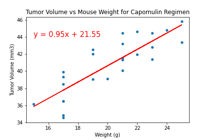

# Statistical-Analysis-Matplotlib
The purpose of the project is to analyze tumor growth in mice. The code uses python pandas in Jupyter Notebook to work with two CSV files, perform an analysis, output plots using Matplotlib, and add a summary analysis within Jupyter Notebook. 

# What the code does (in general terms)
The code opens two corresponding CSV files, reads thru the data and calculates/creates any desired values, and plots the data

# What the code calculates
The **Pymaceuticals** code currently calculates and displays the following:

    Two summary statistics tables consisting of the mean, median, variance, standard deviation, and SEM of the tumor volume for each drug regimen

    Two bar plots that show the total number of timepoints for all mice tested for each drug regimen throughout the course of the study
    
    Two pie plots that show the distribution of female and male mice in the study

    The final tumor volume of each mouse across four treatment regimens: Capomulin, Ramicane, Infubinol, and Ceftamin

    A box and whisker plot of the final tumor volume for four treatment regimens with potential outliers highlighted

    A line plot of tumor volume vs. time point for a random mouse treated with Capomulin

    A scatter plot of tumor volume versus mouse weight for the Capomulin treatment regimen

    The correlation coefficient and linear regression model between mouse weight and average tumor volume for the Capomulin treatment regimen

# Observable Trends
The following trends have been observed in the data.

1) Capomulin and Ramicane appear to outperform Infubinol and Ceftamin in regards to reducing tumor volume.

2) The single outlier found (mouse c326, regimen Infubinol) has a final timepoint of "5". Only two timepoints are given for this mouse ("0" and "5"), and the tumor volume went down between these two timepoints. Given that the final timepoint for many other mice is "45", mouse c326 seems to have not taken part in the study in full, for whatever reason, and could likely be ignored.

3) Tumor volume and mouse weight have a high correlation value (0.84). This could mean that one contributes to the other, or that they have common contributing factors.

# Linear Regression Plot
The following graph displays the linear regression model. The correlation value is .84.

